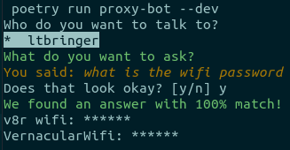

# Procurator

_Helps people talk to you in your absence_

At times you are the only person who knows answer to certain specific things. Maybe because of your profession or
it is a problem you faced, and now each time it rears its head again you would be needed. If you consider these situations
as distractions to something more important at hand, this project is supposed to help. Personally speaking, sometimes
I forget replying to people, because by the time I am free they are asleep or unavailable (majorly close family members). 
At work there are questions that float around like: 

1. What's the wifi password?
2. How do I use the printer/scanner?
3. Where do you keep _that_ thing?
4. _this_ thing stopped working how do we make it work again?
5. What are the numbers of that _project_?

This project lets you create a snapshot of such knowledge. It also allows someone access it naturally (more work needed here).
More details on how it works [later](#working). Clearing the distraction. Kind of like having a proxy for yourself doing 
all the boring things for you.

Some of these questions are a good fit for this project. Answers that don't change frequently, are easy to maintain.
Like the first 2 questions are not going to change on a daily/weekly/monthly basis.

## Naming
procurator /ˈprɒkjʊreɪtə/
noun: procurator; plural noun: procurators
Law: an agent representing others in a court of law in countries retaining Roman civil law.
        (in Scotland) a lawyer practising before the lower courts.
        
But why? because origin of the word **proxy** takes us to a word **procuracy**.


## Project
This project was created as a part of a 1-day Hackathon. Support for different platforms, installation, optimization took a backseat
for the sake of prototype read about [future works](#future-works).

Current Support:
Built over: Ubuntu 18.04
Python: 3.6.5

### Installation
1. Clone this project.
2. Run `poetry install` to install all dependencies.
3. Pull postgres' docker image
    ```
    docker pull postgres
    ```
4. Start the postgres container.
5. Enter the container using `docker exec -it <container-id> bash`
6. In the psql cli Run the following:
    ```sql
    CREATE DATABASE procurator;
    CREATE USER procurator WITH PASSWORD 'procurator';
    ALTER ROLE procurator SET client_encoding to 'utf-8';
    ALTER ROLE procurator SET timezone to 'UTC';
    GRANT ALL PRIVILEGES ON DATABASE procurator TO procurator;
    ```
5. Pull kaldi-serve's docker image. - Optional
    ```
    docker pull vernacularai/kaldi-serve:master
    ```   
6. Start the kaldi-serve container. - Optional
7. Run `poetry run proxy-init` to setup the database with the right roles, and seed data.
8. Run the cli by using:
    ```
    poetry run proxy-bot --dev
    ```

## Working
Once everything is setup, and `proxy-bot` command is invoked. 

1. You will be prompted with a list of users you can ask questions to.
   1. If they have submitted no answers, the session exits.
   2. Otherwise you are prompted to record your question. (kaldi-serve is used to transcribe the audio)
2. You get a chance to fix the transcription of your recording if kaldi-serve was not set-up, 
   an exception will be captured, allowing you to type instead.
3. Your query will be matched against the submissions made by the selected user and the best is returned.

An example:



## Future works
1. I had planned to build this project using Scala and Akka. So I hope for a cross-platform rewrite.
2. This project uses [jellyfish](https://github.com/jamesturk/jellyfish) to find the best answer to a question, more improvements can be made here.
3. There needs to be more restriction on user's that could be seen at a time (currently all the users are queried). I plan for region->org->team->person kind of hierarchy,
   default behaviour would be to show the members of the same team or org.
4. `kaldi-serve` is no good without a model, finding or publishing a pre-trained model could help this project.
5. Keeping the transcription engine itself flexible to choices, people should be able to use any transcription service.
7. Currently all questions submitted by a `user` are loaded into the memory. Akka streams should help reduce this burden.
8. A friendly interface for people who don't code. I have plans for an electron app.
